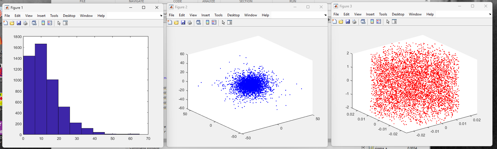

# Neutron Transport Modelling

 <!-- Replace with actual image if available -->

## Overview
This repository contains Monte Carlo simulation codes in MATLAB developed as part of a self-project at the NETP Lab, Indian Institute of Technology Kanpur. The project focuses on modeling neutron transport in H₂O (water) and D₂O (heavy water) using cross-section data from ENDF and JANIS databases. It involves simulating neutron behavior in various geometries, calculating flux distributions, and performing statistical analysis to determine key parameters such as mean free path and reaction rates.

- **Duration**: May 2025 - June 2025
- **Lab**: NETP Lab, IIT Kanpur
- **Key Objectives**:
  - Develop Monte Carlo simulation codes in MATLAB for neutron transport modeling.
  - Simulate multiple source geometries to study neutron scattering and absorption.
  - Calculate neutron flux distributions.
  - Perform statistical analysis on simulated neutron histories to extract parameters like mean free path and reaction rates.

The simulations leverage evaluated nuclear data from ENDF (Evaluated Nuclear Data File) and JANIS (Java-based Nuclear Information Software) databases to ensure accurate cross-section data for interactions in H₂O and D₂O.

## Project Details
### Background
Neutron transport modeling is crucial in nuclear engineering for understanding particle behavior in materials like water (H₂O) and heavy water (D₂O), which are common moderators in nuclear reactors. This project employs the Monte Carlo method, a stochastic technique that simulates individual neutron histories to predict macroscopic properties.

### Methodology
- **Data Sources**: Cross-section data for neutron interactions (e.g., elastic scattering, absorption) in H₂O and D₂O are sourced from ENDF and JANIS databases.
- **Simulation**:
  - Monte Carlo approach to track neutron paths, collisions, and outcomes.
  - Modeling of various source geometries (e.g., point sources, distributed sources).
  - Calculation of neutron flux distributions across the medium.
- **Analysis**:
  - Statistical evaluation of neutron histories.
  - Determination of mean free path (average distance between interactions).
  - Estimation of reaction rates (e.g., scattering, absorption rates).

### Key Features
- MATLAB-based implementation for accessibility and rapid prototyping.
- Focus on comparative analysis between H₂O and D₂O to highlight differences in moderation efficiency.
- Potential for extension to more complex geometries or multi-material systems.

## Repository Structure
- **src/**: Main MATLAB scripts for simulations (e.g., monte_carlo_neutron.m, data_loader.m) – [Placeholder; add actual files based on implementation].
- **data/**: Sample cross-section data files from ENDF/JANIS (if included; ensure compliance with data usage policies).
- **results/**: Output files, plots, and statistical summaries from simulations.
- **docs/**: Additional documentation, reports, or references.
- **figures/**: Generated plots (e.g., flux distributions, histograms of mean free paths).

## Installation and Usage
### Requirements
- MATLAB (version R2023a or later recommended).
- Access to ENDF and JANIS databases for cross-section data (download separately if needed).

### Setup
1. Clone the repository:
   ```
   git clone https://github.com/Garud218/Neutron-Transport-Modelling-Monte-Carlo.git
   ```
2. Navigate to the project directory:
   ```
   cd Neutron-Transport-Modelling-Monte-Carlo
   ```
3. Load cross-section data into MATLAB (refer to scripts for instructions).

### Running Simulations
- Execute the main script:
  ```matlab
  run('Simulation Codes/points_heavywater.m');
  ```
- Adjust parameters such as number of histories, energy ranges, and geometry in the script.

## Results and Insights
- Simulations demonstrate higher moderation in D₂O due to lower absorption cross-sections compared to H₂O.
- Statistical analysis provides confidence intervals for mean free path and reaction rates, ensuring reliability of Monte Carlo results.

## References
- ENDF Database: [https://www-nds.iaea.org/endf/](https://www-nds.iaea.org/endf/)
- JANIS Software: [https://www.oecd-nea.org/jcms/pl_14362/janis-java-based-nuclear-information-software](https://www.oecd-nea.org/jcms/pl_14362/janis-java-based-nuclear-information-software)
- Monte Carlo Methods in Nuclear Physics: Relevant literature on neutron transport (e.g., X-5 Monte Carlo Team, MCNP documentation).

## Contact
For questions or collaborations, reach out via GitHub issues or contact mail to: [neutron@cc.cc](neutron@cc.cc).
